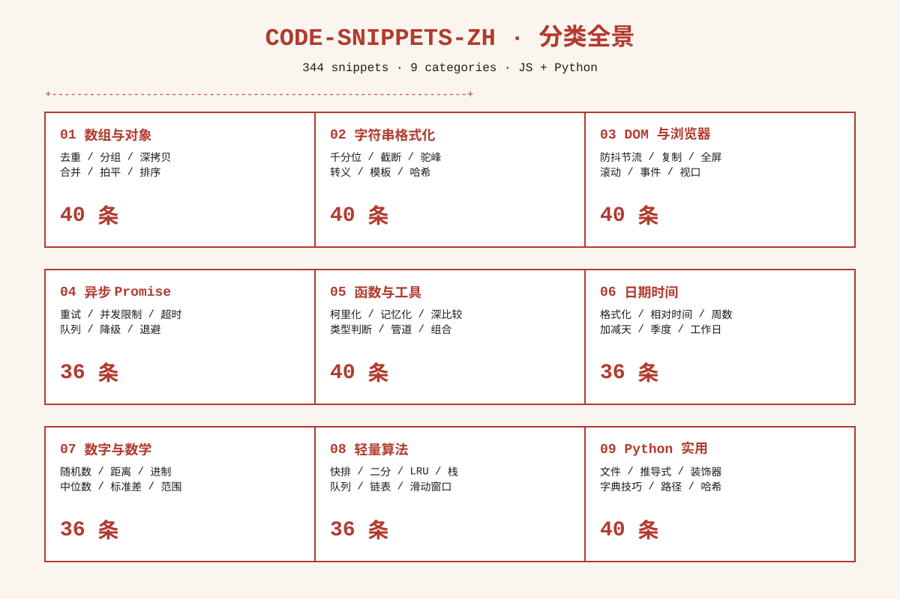
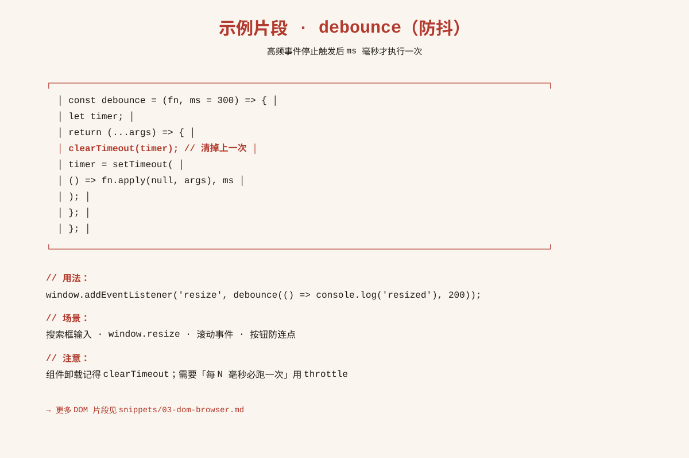
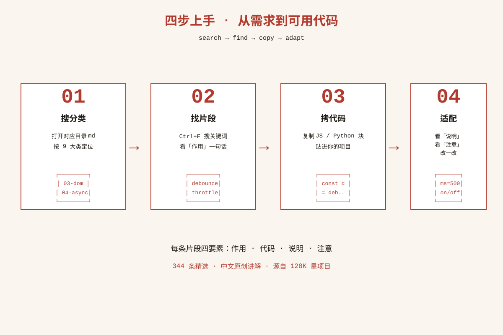

# 实用代码片段速查 · 中文版

> **344 个高频代码片段，面试写码直接抄。**
> 源自 GitHub 128K 星项目 [30-seconds-of-code](https://github.com/Chalarangelo/30-seconds-of-code)（CC BY 4.0 已署名），精选日常写码 / 面试翻查最常用的 JS + Python 片段，每条配原创中文讲解。



⭐ 如果对你有帮助，点个 Star 支持中文开源

## ✨ 这仓库解决什么痛点？

写码时突然想不起来「千分位怎么打」「防抖怎么写」「深拷贝怎么实现」——
别再翻 Google 翻到 Stack Overflow 第三页，也别去背 LeetCode Hard 题。
**这个仓库就是一本「能直接抄」的速查手册**，按场景分类，每条四要素：

- **作用**：一句话告诉你它干嘛
- **代码**：可直接运行的 JS / Python
- **说明**：用法、边界、常见坑
- **注意**：兼容性、替代写法、什么时候别用

> 🎯 **定位**：不是算法题解（那是 javascript-algorithms 的地盘），是**实用代码速查**——DOM、数组、字符串、异步、日期、Python 日常小件。

## 📚 分类速查表

| # | 分类 | 片段数 | 入口 |
|---|------|------:|------|
| 01 | 数组与对象操作（去重 / 分组 / 深拷贝 / 合并） | **40** | [snippets/01-array-object.md](snippets/01-array-object.md) |
| 02 | 字符串与格式化（千分位 / 截断 / 命名风格） | **40** | [snippets/02-string-format.md](snippets/02-string-format.md) |
| 03 | DOM 与浏览器（防抖节流 / 复制 / 全屏 / 滚动） | **40** | [snippets/03-dom-browser.md](snippets/03-dom-browser.md) |
| 04 | 异步与 Promise（重试 / 并发限制 / 超时） | **36** | [snippets/04-async-promise.md](snippets/04-async-promise.md) |
| 05 | 函数与工具（柯里化 / 记忆化 / 深比较） | **40** | [snippets/05-function-util.md](snippets/05-function-util.md) |
| 06 | 日期时间（格式化 / 相对时间 / 周数） | **36** | [snippets/06-datetime.md](snippets/06-datetime.md) |
| 07 | 数字与数学（随机数 / 距离 / 进制） | **36** | [snippets/07-number-math.md](snippets/07-number-math.md) |
| 08 | 轻量数据结构与算法（快排 / 二分 / LRU） | **36** | [snippets/08-algorithms.md](snippets/08-algorithms.md) |
| 09 | Python 实用片段（文件 / 推导式 / 装饰器） | **40** | [snippets/09-python.md](snippets/09-python.md) |
| | **合计** | **344** | |



## 🚀 怎么用？

```
┌──────────────────────────────────────────────────┐
│  1. 想干啥？    →  打开对应分类 md               │
│  2. 找片段      →  Ctrl+F 搜关键词              │
│  3. 抄代码      →  复制 JS / Python 块          │
│  4. 适配场景    →  看「说明 / 注意」改一改       │
└──────────────────────────────────────────────────┘
```



**示例：想写个防抖？**

1. 打开 [snippets/03-dom-browser.md](snippets/03-dom-browser.md)；
2. Ctrl+F 搜「防抖」；
3. 拷代码：

```javascript
const debounce = (fn, ms = 300) => {
  let timer;
  return (...args) => {
    clearTimeout(timer);
    timer = setTimeout(() => fn.apply(null, args), ms);
  };
};
```

4. 看「注意」：组件卸载记得 cancel。

## 💡 为什么值得 Star？

- 📦 **344 条**精选片段，不是大杂烩，每条都按四要素写透；
- 🇨🇳 **全中文原创讲解**，不是机翻文档；
- 🧪 **代码可运行**，每条都经过语法校验；
- ⚖️ **合规署名**：源自 128K 星项目 30-seconds-of-code（CC BY 4.0），如实署名见 [THIRD_PARTY_NOTICES.md](THIRD_PARTY_NOTICES.md)；
- 📖 **持续更新**：日常写码踩到新坑就补一条。

## 📄 许可

- 本仓库**原创内容**（中文讲解、组织方式、README）：[MIT](LICENSE) © 2026 zieang88888
- 参考的代码片段：源自 [Chalarangelo/30-seconds-of-code](https://github.com/Chalarangelo/30-seconds-of-code)，按 **CC BY 4.0** 授权，详见 [THIRD_PARTY_NOTICES.md](THIRD_PARTY_NOTICES.md)

## 🔗 链接

- 原项目：[Chalarangelo/30-seconds-of-code](https://github.com/Chalarangelo/30-seconds-of-code)
- 本仓库：[zieang88888/code-snippets-zh](https://github.com/zieang88888/code-snippets-zh)

---

**If this repo saves you 10 minutes on a Tuesday, give it a ⭐.**


## 姊妹项目

中文开源矩阵，一网打尽开发者的知识库：

- [zhskills · 中文技能库](https://github.com/zieang88888/zhskills)
- [awesome-ai-tools-zh · AI 工具导航](https://github.com/zieang88888/awesome-ai-tools-zh)
- [free-programming-books-zh · 编程书籍大全](https://github.com/zieang88888/free-programming-books-zh)
- [system-design-zh · 系统设计面试](https://github.com/zieang88888/system-design-zh)
- [awesome-python-zh · Python 生态导航](https://github.com/zieang88888/awesome-python-zh)
- [ohmyzsh-zh · 终端效率神器](https://github.com/zieang88888/ohmyzsh-zh)
- [llm-course-zh · LLM 课程导航](https://github.com/zieang88888/llm-course-zh)
- [design-resources-for-developers-zh · 设计资源大全](https://github.com/zieang88888/design-resources-for-developers-zh)
